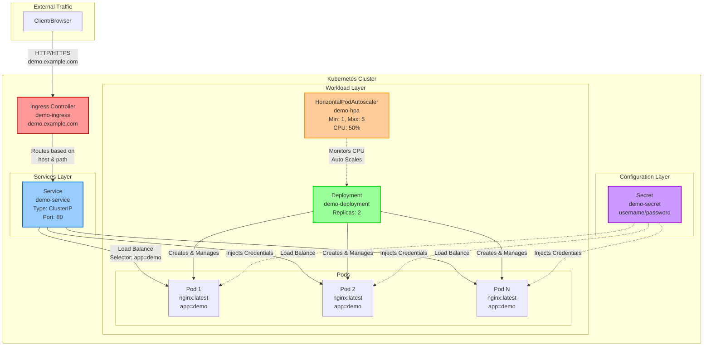
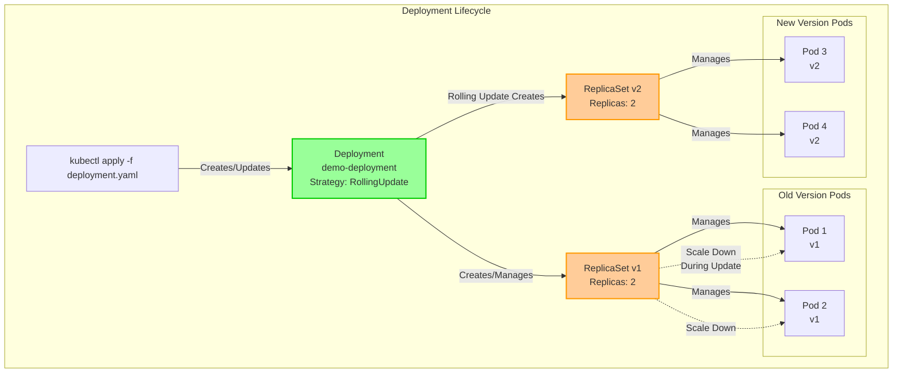
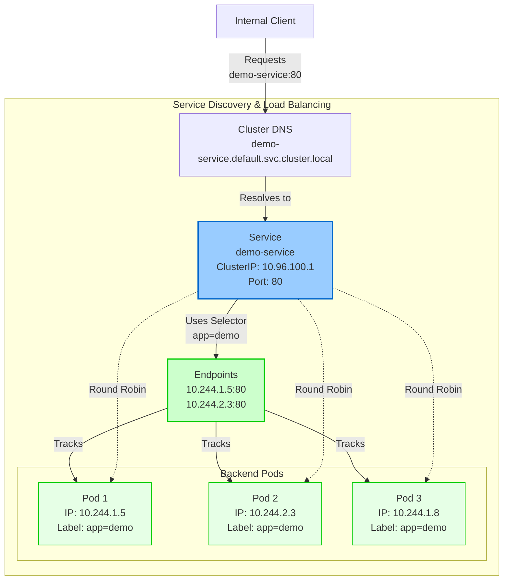
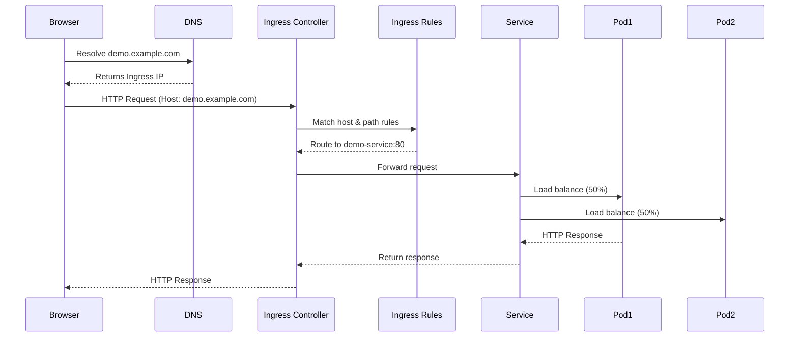
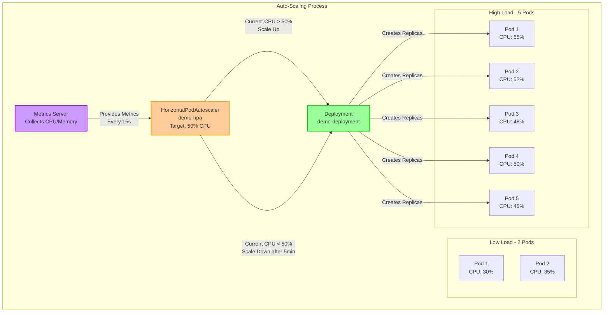
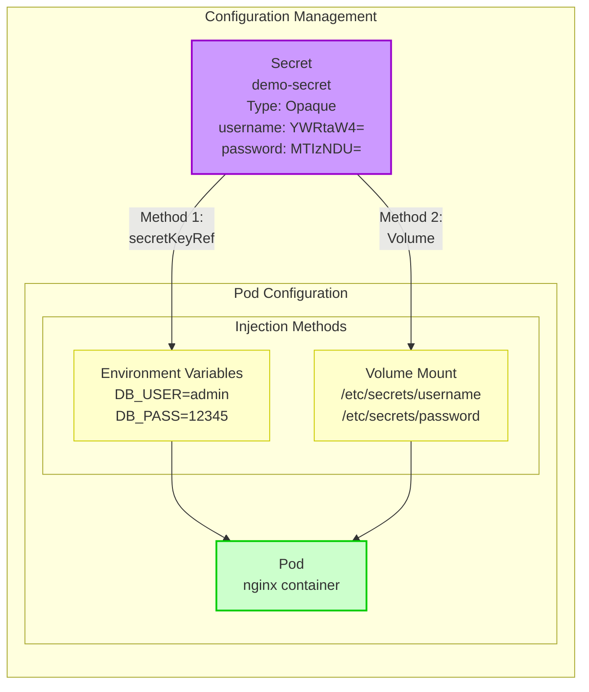

<div align="center">
<h1>🚀 Kubernetes Basics</h1>
<p><strong>Built with ❤️ by <a href="https://github.com/atulkamble">Atul Kamble</a></strong></p>

<p>
<a href="https://codespaces.new/atulkamble/template.git">

</a>
<a href="https://vscode.dev/github/atulkamble/template">

</a>
<a href="https://vscode.dev/redirect?url=vscode://ms-vscode-remote.remote-containers/cloneInVolume?url=https://github.com/atulkamble/template">

</a>
<a href="https://desktop.github.com/">

</a>
</p>

<p>
<a href="https://github.com/atulkamble">

</a>
<a href="https://www.linkedin.com/in/atuljkamble/">

</a>
<a href="https://x.com/atul_kamble">

</a>
</p>

<strong>Version 1.0.0</strong> | <strong>Last Updated:</strong> January 2026
</div>

Below is a **very basic, beginner-friendly Kubernetes (K8s) cheat sheet** with **essential commands + minimal YAML templates**


---

## 🏗️ Architecture Diagrams

### 📊 Complete K8s Application Architecture



### 📦 Deployment Architecture



### 🔀 Service & Load Balancing



### 🌐 Ingress Traffic Flow



### ⚖️ HPA Auto-Scaling Flow



### 🔐 Secret/ConfigMap Injection



---

## 🎯 Points to Remember

### 📚 General Kubernetes Concepts

#### Core Principles
- **Kubernetes** = Container orchestration platform for automating deployment, scaling, and management
- **Pods** = Smallest deployable units; containers run inside pods (1+ containers per pod)
- **Labels & Selectors** = Key-value pairs used to identify and group resources
- **Namespaces** = Logical isolation within a cluster (default, kube-system, kube-public)
- **Declarative Configuration** = Always use YAML files for production (not imperative commands)

#### Key Concepts
- ✅ Kubernetes follows **desired state management** - you declare what you want, K8s makes it happen
- ✅ **Controllers** continuously monitor and reconcile actual state with desired state
- ✅ **Everything is an API resource** with apiVersion, kind, metadata, and spec
- ⚠️ Never run containers directly in production - always use higher-level abstractions (Deployment/StatefulSet)

---

### 📦 Deployment Best Practices

#### Configuration
- ✅ Always specify **resource limits** (CPU, Memory) to prevent resource starvation
  ```yaml
  resources:
    requests:
      cpu: 100m
      memory: 128Mi
    limits:
      cpu: 500m
      memory: 512Mi
  ```
- ✅ Set **liveness and readiness probes** for health checks
- ✅ Use **rolling update strategy** for zero-downtime deployments
- ✅ Keep **replicas ≥ 2** for high availability
- ✅ Use **PodDisruptionBudgets** to ensure availability during maintenance

#### Deployment Strategy
- **RollingUpdate** (default): Gradually replaces old pods with new ones
  - `maxUnavailable`: Max pods that can be unavailable during update
  - `maxSurge`: Max additional pods created during update
- **Recreate**: Kills all old pods before creating new ones (downtime)

#### Important Notes
- ⚠️ Deployment creates and manages **ReplicaSets** automatically
- ⚠️ **Never modify ReplicaSets directly** - always update the Deployment
- ⚠️ ReplicaSet ensures specified number of pod replicas are running
- ⚠️ Use `kubectl rollout status/history/undo` to manage deployments

---

### 🔀 Service Important Notes

#### Service Types
1. **ClusterIP** (default): Internal cluster access only
   - Use for: Database, internal microservices
   - DNS: `<service-name>.<namespace>.svc.cluster.local`

2. **NodePort**: Exposes service on each node's IP at a static port (30000-32767)
   - Use for: Development, testing
   - Access: `http://<node-ip>:<nodePort>`

3. **LoadBalancer**: Cloud provider's external load balancer
   - Use for: Production external access
   - Automatically creates NodePort and ClusterIP

4. **ExternalName**: Maps service to external DNS name
   - Use for: External database, third-party API

#### Key Points
- ✅ Services use **selectors** to find pods (must match pod labels **exactly**)
- ✅ Service provides **stable IP and DNS** even when pods are recreated
- ✅ Supports **session affinity** (sticky sessions) with `sessionAffinity: ClientIP`
- ⚠️ Service routes to **Ready pods only** (passed readiness probe)
- ⚠️ **Endpoints** object tracks pod IPs matching service selector
- ⚠️ If no pods match selector, service will have **0 endpoints**

#### DNS Resolution
```
<service-name>                           # Same namespace
<service-name>.<namespace>               # Different namespace
<service-name>.<namespace>.svc.cluster.local  # Fully qualified
```

---

### 🌐 Ingress Best Practices

#### Prerequisites
- ✅ Requires **Ingress Controller** installed (nginx, traefik, HAProxy, etc.)
- ✅ Ingress controller is NOT installed by default in K8s

#### Use Cases
- ✅ **HTTP/HTTPS routing** (Layer 7 load balancing)
- ✅ **Host-based routing**: Different hosts → Different services
- ✅ **Path-based routing**: Different paths → Different services
- ✅ **TLS/SSL termination** at ingress level
- ✅ **Single external IP** for multiple services

#### Configuration
```yaml
# Path types:
- Exact: /api (matches exactly)
- Prefix: /api (matches /api, /api/v1, /api/users)
- ImplementationSpecific: Depends on ingress controller
```

#### Important Notes
- ⚠️ Ingress rules route to **Services**, not directly to Pods
- ⚠️ Host-based routing requires **proper DNS configuration**
- ⚠️ TLS certificate must be stored as **Secret** and referenced in Ingress
- ⚠️ One Ingress can handle **multiple hosts and paths**
- ⚠️ Ingress controller watches for Ingress resources and configures itself

---

### ⚖️ HPA (HorizontalPodAutoscaler) Key Points

#### Prerequisites
- ✅ Requires **Metrics Server** installed (`kubectl apply -f metrics-server.yaml`)
- ✅ Pods must have **resource requests** defined (HPA uses this as 100% baseline)

#### Scaling Behavior
- **Scale-up**: Immediate when threshold exceeded
- **Scale-down**: 5-minute cooldown by default (prevents flapping)
- **Metric check interval**: 15 seconds (default)
- **Calculation**: `desiredReplicas = ceil[currentReplicas × (currentMetric / targetMetric)]`

#### Supported Metrics
1. **Resource metrics**: CPU, Memory
2. **Custom metrics**: Application-specific (requests/sec, queue length)
3. **External metrics**: Cloud provider metrics (CloudWatch, Stackdriver)

#### Best Practices
- ✅ Set appropriate **min and max replicas** to control costs
- ✅ Use **stabilization window** to prevent rapid scaling
- ✅ Test scaling behavior under load
- ✅ Monitor HPA events: `kubectl describe hpa <name>`

#### Important Notes
- ⚠️ HPA works with **Deployments, ReplicaSets, StatefulSets**
- ⚠️ **Does NOT scale**: Single pods, DaemonSets, Jobs
- ⚠️ If multiple HPAs target same resource, behavior is **undefined**
- ⚠️ **Conflict with manual scaling**: HPA overrides manual replica count
- ⚠️ Scaling disabled if metrics unavailable

---

### 🔐 ConfigMap & Secret Guidelines

#### ConfigMap
- **Purpose**: Non-sensitive configuration data (app settings, config files)
- **Data**: Plain text key-value pairs
- **Use cases**: App config, environment variables, config files

#### Secret
- **Purpose**: Sensitive data (passwords, tokens, SSH keys, TLS certs)
- **Encoding**: Base64 (NOT encryption)
- **Types**: Opaque, TLS, Docker registry, Service account

#### Consumption Methods

**Method 1: Environment Variables**
```yaml
env:
- name: DB_HOST
  valueFrom:
    configMapKeyRef:
      name: app-config
      key: database_host
```

**Method 2: Volume Mounts** (for large files)
```yaml
volumes:
- name: config
  configMap:
    name: app-config
volumeMounts:
- name: config
  mountPath: /etc/config
```

#### Best Practices
- ✅ Use **Secrets** for sensitive data, **ConfigMaps** for non-sensitive
- ✅ Enable **encryption at rest** for Secrets
- ✅ Use **volume mounts** for large config files (>1KB)
- ✅ Use **RBAC** to restrict access to Secrets
- ✅ Consider **external secret managers** (Vault, AWS Secrets Manager)

#### Important Notes
- ⚠️ ConfigMaps/Secrets must exist **before** pod creation
- ⚠️ Pods **don't auto-restart** when ConfigMap/Secret changes (use config reloader or rolling restart)
- ⚠️ Maximum size: **1MB** per ConfigMap/Secret
- ⚠️ Secrets are **base64 encoded**, not encrypted by default
- ⚠️ Secrets stored in **etcd** - ensure etcd encryption is enabled

#### Encoding/Decoding Secrets
```bash
# Encode
echo -n 'admin' | base64     # Output: YWRtaW4=

# Decode
echo 'YWRtaW4=' | base64 -d  # Output: admin
```

---

### 🛡️ Security Best Practices

#### Access Control
- ✅ Use **RBAC** (Role-Based Access Control) for fine-grained permissions
- ✅ Follow **principle of least privilege**
- ✅ Use **ServiceAccounts** for pod-to-API authentication
- ✅ Enable **audit logging** to track API access

#### Pod Security
- ✅ Run containers as **non-root user**
  ```yaml
  securityContext:
    runAsNonRoot: true
    runAsUser: 1000
  ```
- ✅ Use **Pod Security Standards** (Privileged, Baseline, Restricted)
- ✅ Enable **AppArmor/SELinux** profiles
- ✅ Set **read-only root filesystem**
- ✅ Drop unnecessary **Linux capabilities**

#### Network Security
- ✅ Enable **Network Policies** for pod-to-pod communication control
- ✅ Use **TLS** for all external communication
- ✅ Isolate namespaces with network policies

#### Image Security
- ✅ Scan container images for **vulnerabilities** (Trivy, Snyk)
- ✅ Use **minimal base images** (Alpine, Distroless)
- ✅ Sign and verify images with **Cosign**
- ✅ Use **private registries** with authentication
- ✅ Implement **ImagePullPolicy: Always** to get latest security patches

---

### 🚀 Common Troubleshooting Commands

```bash
# Pod Status & Events
kubectl describe pod <pod-name>
kubectl get pod <pod-name> -o yaml

# Logs
kubectl logs <pod-name>                    # Current logs
kubectl logs <pod-name> -f                 # Follow logs
kubectl logs <pod-name> --previous         # Previous container (if crashed)
kubectl logs <pod-name> -c <container>     # Specific container in multi-container pod

# Interactive Debug
kubectl exec -it <pod-name> -- /bin/bash
kubectl exec -it <pod-name> -- env         # Check environment variables

# Service & Networking
kubectl get endpoints <service-name>       # Check service endpoints
kubectl get svc <service-name> -o wide     # Service details
kubectl port-forward pod/<pod-name> 8080:80  # Local port forwarding

# HPA & Metrics
kubectl get hpa
kubectl describe hpa <hpa-name>
kubectl top nodes                          # Node resource usage
kubectl top pods                           # Pod resource usage

# Events & Debugging
kubectl get events --sort-by=.metadata.creationTimestamp
kubectl get events -n <namespace> --watch

# Configuration
kubectl get configmap <name> -o yaml
kubectl get secret <name> -o yaml
kubectl describe ingress <name>

# Deployment Management
kubectl rollout status deployment/<name>
kubectl rollout history deployment/<name>
kubectl rollout undo deployment/<name>      # Rollback
kubectl rollout restart deployment/<name>   # Force restart
```

---

### 📊 Resource Management Tips

#### Resource Requests vs Limits

**Requests** = Minimum guaranteed resources
- Used for **scheduling** - pod won't be scheduled if node can't meet requests
- **Best practice**: Set to average usage

**Limits** = Maximum allowed resources
- **CPU**: Throttled if exceeded
- **Memory**: Pod evicted (OOMKilled) if exceeded
- **Best practice**: Set to peak usage

```yaml
resources:
  requests:      # Guaranteed minimum
    cpu: 100m    # 0.1 CPU core
    memory: 128Mi
  limits:        # Maximum allowed
    cpu: 500m    # 0.5 CPU core
    memory: 512Mi
```

#### Resource Units
- **CPU**: `1000m = 1 core`, `500m = 0.5 core`, `100m = 0.1 core`
- **Memory**: `128Mi`, `1Gi`, `512Mi` (use Mi/Gi, not M/G)

#### Namespace-Level Controls

**LimitRange**: Sets default/min/max for pods in namespace
```yaml
apiVersion: v1
kind: LimitRange
metadata:
  name: mem-limit-range
spec:
  limits:
  - default:        # Default limits
      memory: 512Mi
    defaultRequest: # Default requests
      memory: 256Mi
    max:           # Maximum allowed
      memory: 1Gi
    type: Container
```

**ResourceQuota**: Limits total resources per namespace
```yaml
apiVersion: v1
kind: ResourceQuota
metadata:
  name: compute-quota
spec:
  hard:
    requests.cpu: "10"
    requests.memory: 20Gi
    limits.cpu: "20"
    limits.memory: 40Gi
    pods: "50"
```

#### Best Practices
- ⚠️ **Always set requests and limits** to prevent resource starvation
- ⚠️ Pod evicted if exceeds memory limit (**OOMKilled**)
- ⚠️ CPU is **throttled** (not killed) if exceeds limit
- ⚠️ If only limits set (no requests), requests = limits automatically
- ⚠️ Use **LimitRanges** to enforce defaults
- ⚠️ Use **ResourceQuotas** to control total namespace usage

---

### 🔍 Quick Debugging Checklist

**Pod not starting?**
1. Check events: `kubectl describe pod <name>`
2. Check image pull: `kubectl get events | grep -i pull`
3. Check resources: `kubectl describe node <node-name>`
4. Check logs: `kubectl logs <pod-name>`

**Service not reachable?**
1. Check endpoints: `kubectl get endpoints <service-name>`
2. Verify labels match: `kubectl get pods --show-labels`
3. Check pod readiness: `kubectl get pods`
4. Test from within cluster: `kubectl run curl --image=curlimages/curl -it --rm -- curl <service-name>`

**Ingress not working?**
1. Check ingress controller: `kubectl get pods -n ingress-nginx`
2. Check ingress resource: `kubectl describe ingress <name>`
3. Check service backend: `kubectl get svc`
4. Check DNS resolution

**HPA not scaling?**
1. Check metrics server: `kubectl get deployment metrics-server -n kube-system`
2. Check current metrics: `kubectl get hpa`
3. Verify resource requests: `kubectl describe pod <name>`
4. Check HPA events: `kubectl describe hpa <name>`

---

## 1️⃣ Basic `kubectl` Commands (Must-Know)

### 🔹 Cluster & Context

```bash
kubectl version
kubectl cluster-info
kubectl config get-contexts
kubectl config use-context <context-name>
```

### 🔹 Nodes

```bash
kubectl get nodes
kubectl describe node <node-name>
```

### 🔹 Pods

```bash
kubectl get pods
kubectl get pods -o wide
kubectl describe pod <pod-name>
kubectl delete pod <pod-name>
```

### 🔹 Namespaces

```bash
kubectl get ns
kubectl create ns dev
kubectl get pods -n dev
```

---

## 2️⃣ Very Basic Pod Template (pod.yaml)

```yaml
apiVersion: v1
kind: Pod
metadata:
  name: nginx-pod
spec:
  containers:
  - name: nginx
    image: nginx
    ports:
    - containerPort: 80
```

### ▶ Apply & Test

```bash
kubectl apply -f pod.yaml
kubectl get pods
kubectl port-forward nginx-pod 8080:80
```

➡ Open: `http://localhost:8080`

---

## 3️⃣ Deployment (Recommended instead of Pod)

### deployment.yaml

```yaml
apiVersion: apps/v1
kind: Deployment
metadata:
  name: nginx-deployment
spec:
  replicas: 2
  selector:
    matchLabels:
      app: nginx
  template:
    metadata:
      labels:
        app: nginx
    spec:
      containers:
      - name: nginx
        image: nginx
        ports:
        - containerPort: 80
```

### ▶ Commands

```bash
kubectl apply -f deployment.yaml
kubectl get deployments
kubectl get pods
```

---

## 4️⃣ Service (Expose App)

### service.yaml (NodePort – easiest for beginners)

```yaml
apiVersion: v1
kind: Service
metadata:
  name: nginx-service
spec:
  type: NodePort
  selector:
    app: nginx
  ports:
  - port: 80
    targetPort: 80
    nodePort: 30007
```

### ▶ Commands

```bash
kubectl apply -f service.yaml
kubectl get svc
```

➡ Access:
`http://<NODE-IP>:30007`

---

## 5️⃣ Scale Deployment

```bash
kubectl scale deployment nginx-deployment --replicas=5
kubectl get pods
```

---

## 6️⃣ Logs & Exec (Very Important)

### Logs

```bash
kubectl logs <pod-name>
kubectl logs -f <pod-name>
```

### Exec into Pod

```bash
kubectl exec -it <pod-name> -- /bin/bash
```

---

## 7️⃣ Delete Resources

```bash
kubectl delete pod nginx-pod
kubectl delete deployment nginx-deployment
kubectl delete svc nginx-service
kubectl delete -f deployment.yaml
```

---

## 8️⃣ One-Line Quick Runs (Super Basic)

```bash
kubectl run nginx --image=nginx
kubectl expose pod nginx --type=NodePort --port=80
kubectl get all
```

---

## 9️⃣ Minimal Folder Structure (Best Practice)

```text
k8s-basic/
├── pod.yaml
├── deployment.yaml
└── service.yaml
```

---

## 🔟 What You Should Practice First

✅ Pod vs Deployment
✅ Labels & Selectors
✅ Service types (ClusterIP → NodePort → LoadBalancer)
✅ Scaling
✅ Logs & Exec

---
Below is **very basic, beginner-friendly Kubernetes YAML** for each resource.
You can **copy–paste and apply directly**.
(No advanced fields, no production extras.)

---

## 1️⃣ Deployment (Nginx)

```yaml
apiVersion: apps/v1
kind: Deployment
metadata:
  name: demo-deployment
spec:
  replicas: 2
  selector:
    matchLabels:
      app: demo
  template:
    metadata:
      labels:
        app: demo
    spec:
      containers:
      - name: nginx
        image: nginx
        ports:
        - containerPort: 80
```

Apply:

```bash
kubectl apply -f deployment.yaml
```

---

## 2️⃣ Service (ClusterIP)

```yaml
apiVersion: v1
kind: Service
metadata:
  name: demo-service
spec:
  type: ClusterIP
  selector:
    app: demo
  ports:
  - port: 80
    targetPort: 80
```

Apply:

```bash
kubectl apply -f service.yaml
```

---

## 3️⃣ ConfigMap (Simple Key-Value)

```yaml
apiVersion: v1
kind: ConfigMap
metadata:
  name: demo-config
data:
  APP_NAME: "MyDemoApp"
  ENV: "dev"
```

Use in Pod (example):

```yaml
env:
- name: APP_NAME
  valueFrom:
    configMapKeyRef:
      name: demo-config
      key: APP_NAME
```

---

## 4️⃣ Secret (Base64 Encoded)

```yaml
apiVersion: v1
kind: Secret
metadata:
  name: demo-secret
type: Opaque
data:
  username: YWRtaW4=      # admin
  password: MTIzNDU=      # 12345
```

> Encode value:

```bash
echo -n admin | base64
```

Use in Pod:

```yaml
env:
- name: DB_USER
  valueFrom:
    secretKeyRef:
      name: demo-secret
      key: username
```

---

## 5️⃣ Ingress (Very Basic)

> ⚠️ Requires **Ingress Controller** (like NGINX Ingress)

```yaml
apiVersion: networking.k8s.io/v1
kind: Ingress
metadata:
  name: demo-ingress
spec:
  rules:
  - host: demo.example.com
    http:
      paths:
      - path: /
        pathType: Prefix
        backend:
          service:
            name: demo-service
            port:
              number: 80
```

Test locally (optional):

```bash
curl -H "Host: demo.example.com" http://<INGRESS-IP>
```

---

## 6️⃣ HPA (CPU Based)

> ⚠️ Requires **metrics-server**

```yaml
apiVersion: autoscaling/v2
kind: HorizontalPodAutoscaler
metadata:
  name: demo-hpa
spec:
  scaleTargetRef:
    apiVersion: apps/v1
    kind: Deployment
    name: demo-deployment
  minReplicas: 1
  maxReplicas: 5
  metrics:
  - type: Resource
    resource:
      name: cpu
      target:
        type: Utilization
        averageUtilization: 50
```

Check:

```bash
kubectl get hpa
```

---

## 📁 Recommended File Structure

```
k8s-basic/
│── deployment.yaml
│── service.yaml
│── configmap.yaml
│── secret.yaml
│── ingress.yaml
│── hpa.yaml
```

---


